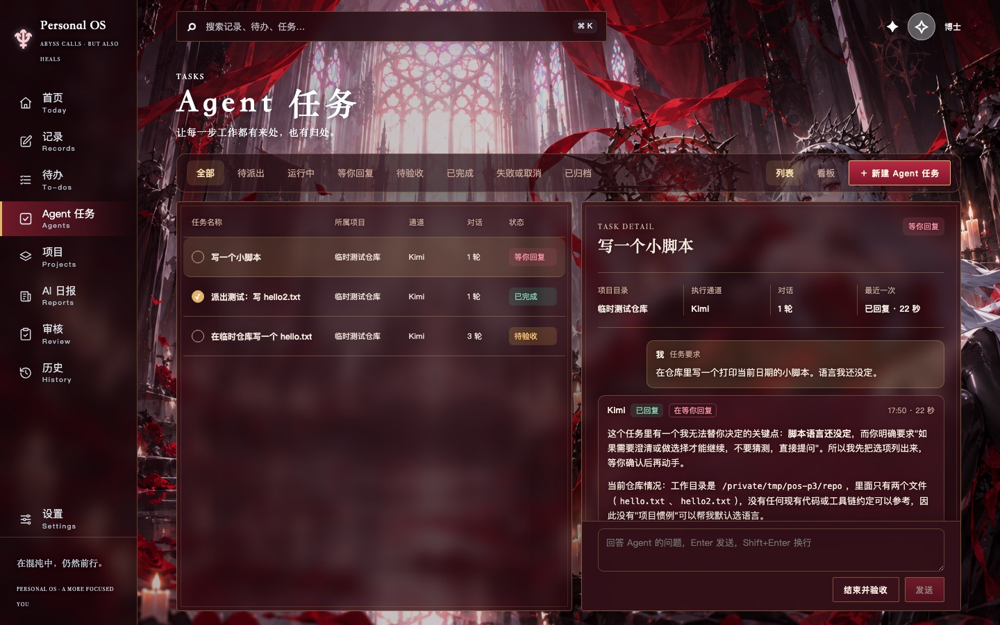
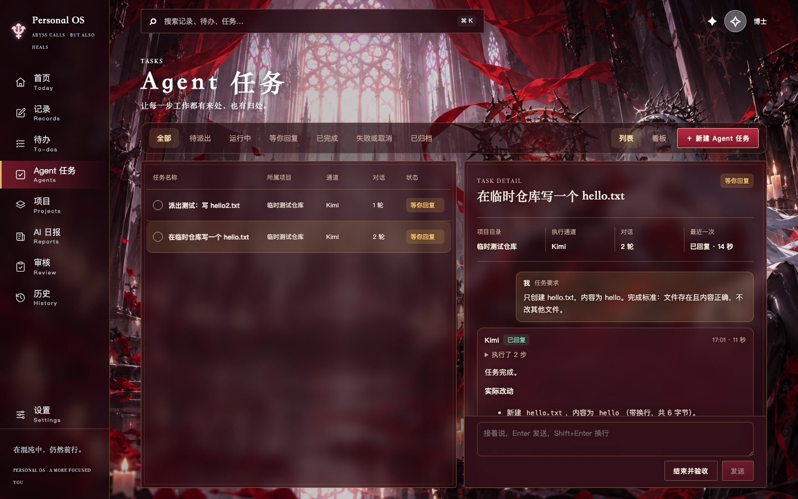
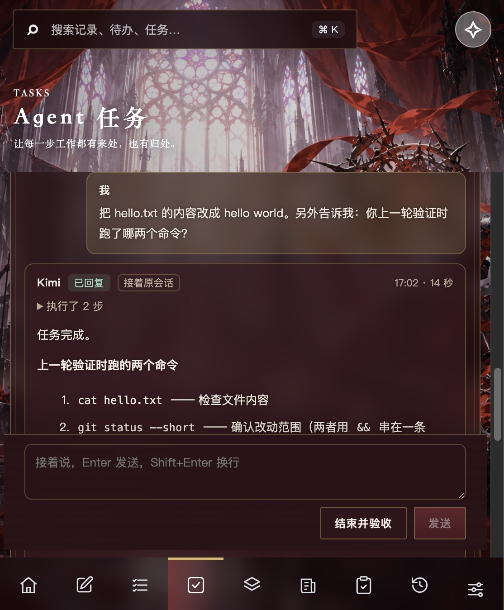
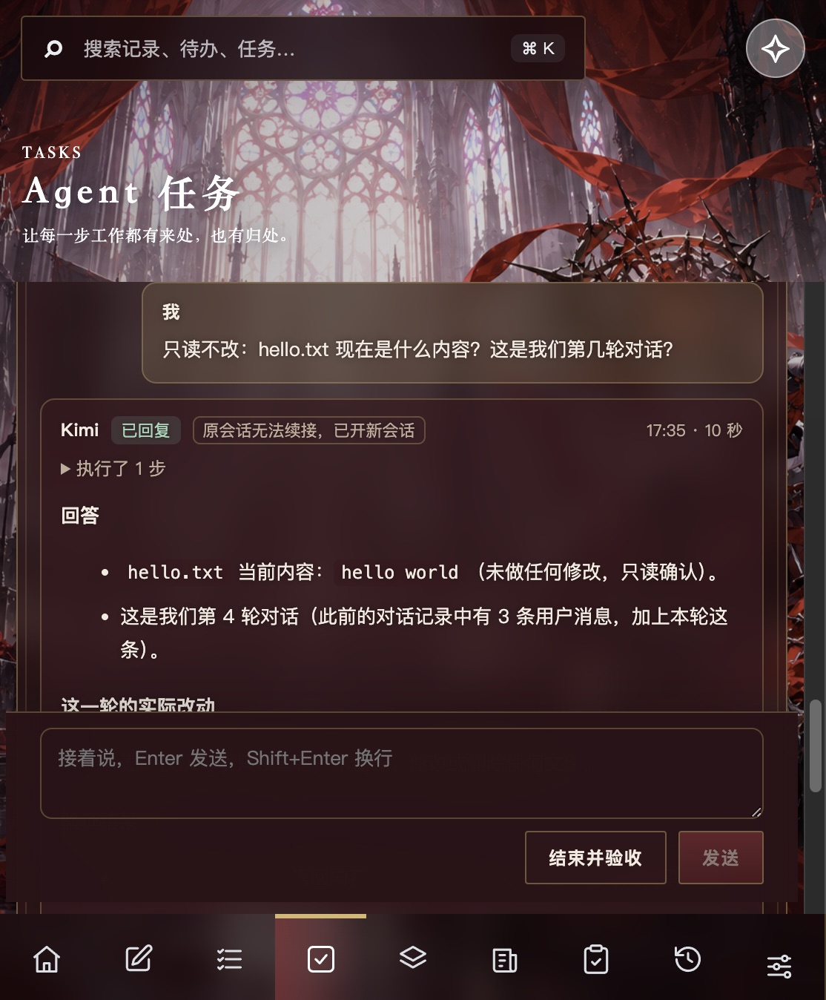
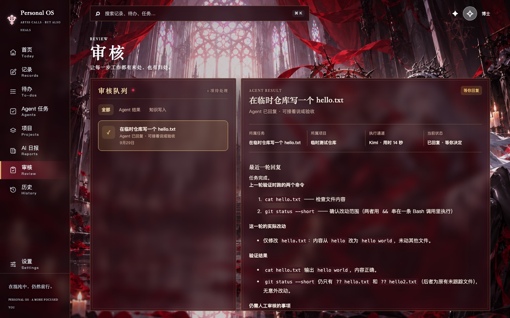

# Agent 任务对话化验收记录

范围依据 [Agent 任务对话化计划](2026-09-29_agent-chat-plan.md)。界面走查用 `/tmp/pos-p3/` 的数据库副本；真实 Kimi 派单只针对 `/tmp/pos-p3/repo` 临时仓库。未写入真实客户端数据库、真实 Obsidian vault 或真实项目，也未重启正在运行的客户端。

## 阶段与提交

| 阶段 | 交付 | 验证 | 提交 |
|---|---|---|---|
| 修复 | Kimi / Claude 沙箱放行 `/tmp`，Agent 往 `/tmp` 写临时文件不再报 `Operation not permitted` | 真实沙箱测试写 `/tmp/pos-sandbox-probe-*.txt` | `9393624` |
| 1 | 计划文档 | — | `a878740` |
| 2 | 后端：每轮保存用户消息和回复（文字、工具调用）；`send_agent_message`；Kimi `-S`、Claude `-r` 续接原会话；续接失败且没有回复时自动开新会话并附上此前对话；失败或取消后也能结束验收 | `tests/test_runtime.py` 新增续接、续接失败兜底、发送条件用例 | `3233500` |
| 3 | 前端：对话流、输入框（Enter 发送）、结束并验收、「等你回复」、累计改动合并；审核页显示最近一轮回复，移除旧的修改意见弹窗 | 浏览器走查，下文截图 | `74958eb` |
| 4 | 本记录、README；重建客户端 | `npm run check`，`codesign --verify` | `82ce8aa` |
| 5 | 区分「等你回复」和「待验收」：Agent 提问时在回复末行写【需要你回复】，系统据此标记这一轮并去掉标记；看板、列表、首页、审核页跟着区分 | `tests/test_runtime.py` 新用例；Kimi 真实两轮 | 本次提交 |

## 检查结果

- `npm run check`：前端构建通过；前端测试 15 项通过；Python 测试 143 项通过（第 5 阶段后）。
- `./scripts/build-macos-app.sh` 重建 `build/Personal OS.app`，`codesign --verify --deep --strict` 通过。

## 真实 Kimi 三轮（Kimi 2.1.1，`/tmp/pos-p3/repo`）

任务「在临时仓库写一个 hello.txt」，要求只创建 `hello.txt`，内容为 `hello`。

1. 第一轮（派出）：Kimi 写入 `hello.txt`，用 `cat hello.txt && git status --short` 验证，约 11 秒回复。会话编号 `session_5970f909…`。
2. 第二轮（在输入框发送「把 hello.txt 的内容改成 hello world。另外告诉我：你上一轮验证时跑了哪两个命令？」）：带 `-S` 接着原会话，提示里只有新消息。Kimi 改好文件，并答出上一轮的两个命令。会话编号不变，这一轮标「接着原会话」。
3. 第三轮（续接失败兜底）：把数据库副本里上一轮的会话编号改成不存在的编号，再发「只读不改：hello.txt 现在是什么内容？这是我们第几轮对话？」。Kimi 报 `Session … not found` 退出，系统记一行「原会话无法续接，已开新会话并附上之前的对话」，改用新会话重试。新会话答出 `hello world`、没有改文件，这一轮标「原会话无法续接，已开新会话」。它把轮数说成第 4 轮（把任务要求也算成一条用户消息），内容上是连贯的。

最后仓库里 `hello.txt` 为 `hello world`，`git status` 只有 `hello.txt` 和第三阶段留下的 `hello2.txt`。

## 等你回复与待验收（Kimi 2.1.1，`/tmp/pos-p3/repo`）

为什么用标记：Kimi 在 `-p` 模式下不能调用 `AskUserQuestion`（实测它回复「当前处于 auto 权限模式，系统不允许我调用 AskUserQuestion 工具」，改用文字提问），事件流里没有「在等用户回答」的信号，所以约定标记。

1. 新任务「写一个小脚本」，要求里故意不说语言。Kimi 没有写文件，列出 Python / Bash / Node 三个选项并在末行写了标记。这一轮 `needs_reply` 为真，保存的回复里已去掉标记；任务显示「等你回复」，这一轮标「在等你回复」，输入框提示「回答 Agent 的问题」。
2. 回复「用 Bash，格式默认就行」：接着原会话，写好 `print_date.sh` 并运行得到 `2026-09-29`。这一轮没有标记，任务变为「待验收」。它结尾的「如需我提交请告知」这类客套话没有被当成提问。

看板改为六列，1440 与 1280 宽度下都不溢出（每列约 118px 和 101px）。

## 界面走查

1440×900：任务详情里依次是任务要求、每轮 Agent 回复（工具调用折叠为「执行了 N 步」）、用户消息；底部是输入框和「结束并验收」。打开任务时停在顶部，有新一轮时才自动滚到底。

第二轮：用户消息在右，Kimi 回复标「接着原会话」。窄窗口下输入框贴在屏幕底部。

第三轮：续接失败后自动开新会话。

审核页：显示「Agent 已回复 · 可接着说或验收」、最近一轮回复和累计改动，按钮为「结束并验收」「去对话里接着说」「重新执行」。

「结束并验收」：在「派出测试：写 hello2.txt」上点击并确认后，任务变为「已完成」，输入框消失。累计改动中 `hello.txt` 先新建、后修改，合并为一行。

## 已知限制与待你确认

- Claude Code 的 `-r` 续接未实测（本机模型服务余额不足）；Codex、Multica 每轮开新会话，靠提示里附上的此前对话（最近 10 轮，每轮回复截取末尾 4000 字）保持上下文，没有真实跑过多轮。
- Agent 运行中不能插话，只能取消；回复后再接着说。
- 「等你回复」依赖 Agent 按约定写标记。漏写时显示「待验收」，问题仍在对话里，可以直接回答。升级前已结束的轮次没有标记，统一显示「待验收」。Claude Code、Codex 是否照做未实测。
- 任务详情区较窄，长回复需要滚动。用过后再决定是否单独开宽的对话页。
- 回复解析依赖各 CLI 的 stream-json 格式，CLI 升级后可能要跟着调整。
- 重启客户端后才会切到新版本。
