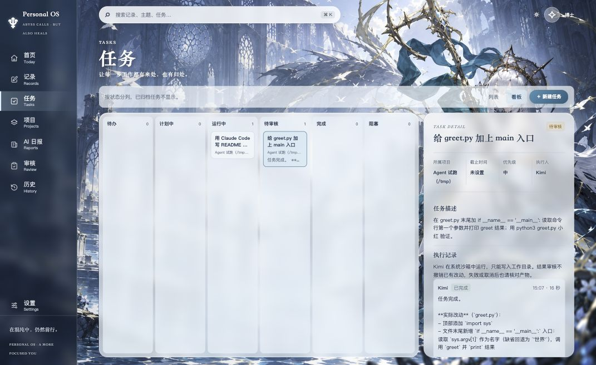
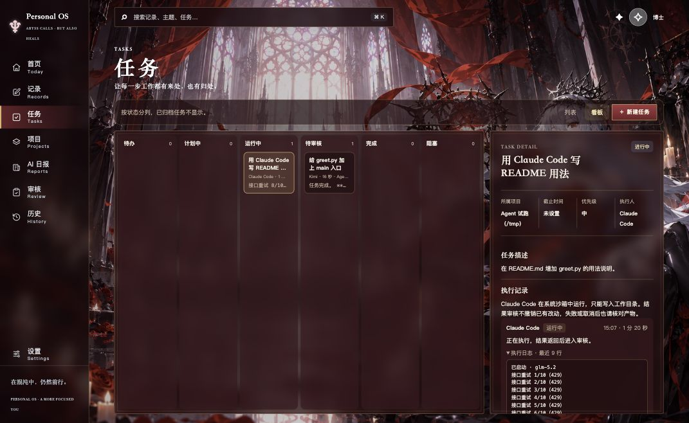
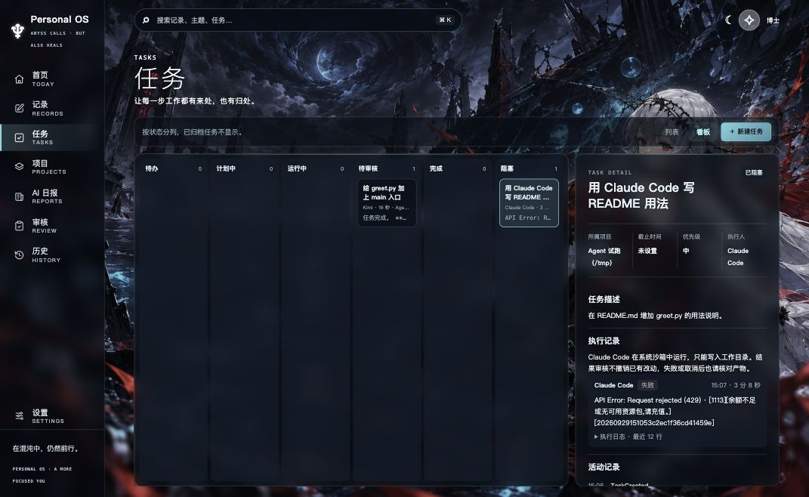
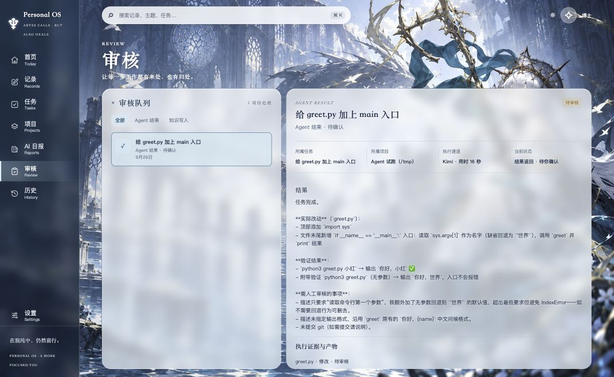

# 第二阶段（Agent 派单与看板）验收记录

范围依据 [第二阶段计划](2026-09-29_phase2-plan.md)。本机只使用直连通道（Kimi、Claude Code，Codex 可填路径）；开源 Multica 通道已写好，待在能使用 Docker 的机器上验证。所有真实派单只针对 `/tmp/pos-trial/` 下的临时 git 仓库，界面走查使用复制到 `/tmp` 的数据库，未改动真实客户端数据、真实项目或 Obsidian vault。

## 阶段与提交

| 阶段 | 交付 | 验证 | 提交 |
|---|---|---|---|
| 计划 | 第二阶段计划文档 | — | `c2224b5` |
| 0 | 首页会话文件名可在访达中定位，提交哈希可打开提交详情；Obsidian 回写核对步骤与 7 天试用表 | `tests/test_traces.py`，隔离环境浏览器走查 | `e9fa9f4` |
| 1 | `server/runtime.py` 运行时接口；Codex 改为可在设置中填写路径；执行记录新增通道、外部编号、日志尾部 | `tests/test_runtime.py`，原有执行测试全部迁移通过 | `7953a0e` |
| 2 | Kimi、Claude Code 直连通道，经 macOS `sandbox-exec` 限制只能写入工作目录；审核标出工作目录外的写入 | `/tmp` 试跑样例存入 `tests/fixtures/`，真实沙箱测试 | `caff18c` |
| 3 | 任务页列表 / 看板切换、选择通道派出、执行详情（日志、取消、重试）、审核显示通道与用时 | 真实 Kimi / Claude Code 派单，三套主题截图 | `dc76acc` |
| 4 | 开源 Multica 通道（命令行 JSON），重启后按 issue 编号续跟，退回后用 `issue rerun` | `tests/test_multica.py`（手写样例，未经真实服务端核对） | `cd499ff` |
| 5 | 本记录、README、方向文档实施状态；客户端命令搜索路径加入 `~/.kimi-code/bin`，沙箱规则的正则转义改为独立函数；重建客户端 | `npm run check`，`codesign --verify`，用客户端 PATH 核对各通道命令 | 本次提交 |

## 试跑结论（阶段 2 进入条件）

试跑环境：Kimi Code CLI 0.40.1，Claude Code 2.1.199，macOS 26（Darwin 25.6）。

| 检查 | Kimi | Claude Code |
|---|---|---|
| 非交互输出 | `-p … --output-format stream-json`：每行一条消息，工具调用在工具执行完后才输出；会话编号在最后一行 | `-p --output-format stream-json --verbose`；最终 `result` 事件的 `is_error` 才是成败依据（余额不足时 `subtype` 仍为 `success`） |
| 退出码 | 成功 0，被取消 143 | 接口错误时 1 |
| 只写工作目录 | **自身不限制**：`-p` 模式下按要求写入了工作目录外的文件；`-p` 不能与 `-y` 同用 | 未能实测（见下） |
| 终止 | 取消后 Kimi 及其 `bash -c … sleep 120` 子进程全部结束，进程组无残留 | 未能实测 |

Kimi 无法自行限制写入范围，按计划停下汇报，用户选择用 macOS `sandbox-exec` 包一层：只允许写入工作目录、Agent 自己的状态目录（`~/.kimi-code/`、`~/.claude*`）、系统临时目录和 `/dev`。加沙箱后复测：正常任务照常写入；Kimi 的写文件工具得到「permission denied」；改用 shell 写入工作目录外得到「Operation not permitted」，均未写出文件。Claude Code 在沙箱中能正常启动并连到接口，无报错。

Claude Code 当前配置的模型服务（`glm-5.2`）返回「余额不足或无可用资源包，请充值」，重试 10 次后失败。因此 Claude Code 的写入范围、完成路径和取消都未实测，通道按文档格式与本次失败样例实现，标为待实测。

## P01–P08 本机结果

| ID | 场景 | 结果 | 依据 |
|---|---|---|---|
| P01 | 某个 Agent 命令找不到 | 通过 | 终端启动的预览 PATH 中没有 Codex：设置显示「Codex · 未找到」，任务表单标「本机未找到」，派出下拉只列 Kimi、Claude Code；直接调用返回「本机未找到 … 命令行，可在设置中填写路径」；未配置的 Homebrew `multica` 显示「未启用」 |
| P02 | 指派给 Kimi / Claude Code | Kimi 通过；Claude Code 仅失败路径 | 在看板选择 Kimi 派出，卡片进入「运行中」，显示最后一行日志（`Edit greet.py`），详情可展开日志。Claude Code 派出后卡片实时显示「接口重试 7/10（429）」，约 3 分钟后因余额不足进入「阻塞」，完整错误可见，按钮变为「重试」 |
| P03 | Agent 完成 | 通过（Kimi） | 进入「待审核」，审核页显示「执行通道 Kimi · 用时 16 秒」、结果全文与 `greet.py · 修改`；确认后任务完成，产物标为已确认 |
| P04 | 退回并补充要求 | 通过（Kimi） | 补充「支持 --upper 参数」后再次执行，Kimi 修改并验证 `python3 greet.py 小红 --upper`，结果回到「待审核」 |
| P05 | 运行中取消 | 通过（Kimi） | 取消前存在 `sleep 120` 子进程，取消 3 秒后无残留；执行为「已取消」，任务为「阻塞」 |
| P06 | 运行中重启 | 通过（Kimi） | 执行中向后台发送 SIGTERM（与退出客户端相同的路径），子进程随之结束；重启后执行为「已中断」，提示「客户端已关闭，执行中断」，任务为「阻塞」，没有永远运行中的任务。本次 Kimi 尚未写出文件，重启后补采产物由单元测试覆盖 |
| P07 | 修改工作目录以外的文件 | 通过 | 沙箱阻止（真实 Kimi 两次尝试均被拒绝，`tests/test_runtime.py` 另有真实沙箱测试）；写文件类工具的目标路径在执行详情和审核页标出 |
| P08 | 现有流程不变 | 通过 | `npm run check`：前端测试 15 项、Python 测试 134 项全部通过 |

截图（1530×940 缩放 0.7）：

- 潮汐圣域，Kimi 完成后待审核：
- 赤色剧场，Claude Code 运行中的实时日志：
- 深海回响，Claude Code 失败后阻塞：
- 审核页显示通道与用时：

## 未验证与已知限制

- **Codex 在桌面客户端中可用**：客户端的命令搜索路径包含 ChatGPT.app 自带的 `codex-cli 0.155.0-alpha.16.4`，其 `exec` 参数与 Codex 通道一致；本次未用它实际派单。客户端还新增了 Kimi 的默认安装目录 `~/.kimi-code/bin`，用客户端的 PATH 核对后 Kimi、Claude Code、Codex 均能找到。
- **Claude Code 待实测**：需要恢复模型服务余额或更换服务后，在 `/tmp` 仓库补做 P02–P05 与越界写入。
- **Multica 待验证**：在能使用 Docker 的机器上自建服务端后，P02–P05 各做一次，并验证重启后续跟。JSON 字段来自手写样例，首次接入可能需要按真实输出调整。
- **Kimi 日志粒度**：Kimi 在工具执行完成后才输出该步，长时间运行的命令在结束前看不到新日志。
- **越界标记范围**：只标出写文件类工具的目标路径；shell 命令里的路径不解析，但同样被沙箱拒绝，拒绝信息出现在日志中。
- **沙箱边界**：只限制写入，不限制读取和网络；Agent 仍可写自己的状态目录和系统临时目录。`sandbox-exec` 已被 Apple 标为不推荐使用，系统升级后需复测。
- **直连通道不能续跑**：退出客户端会终止执行并标为中断，需人工重试。客户端异常崩溃（未走正常退出）时 Agent 进程组的去留未测试。
- **Kimi 配置提示**：日志首行会出现 Kimi 自身的配置弃用提示（`max_retries_per_step`），来自用户的 Kimi 配置，Personal OS 未修改它。
- **阶段 1 顺带修复**：主题改版时「保存设置」改为只保存称呼，导致连接器面板的 Vault 路径和仓库扫描目录只能借其他面板的按钮保存；现在该面板有独立的「保存连接器设置」。

## 仍需用户完成

- [首页验收记录](2026-09-29_home-redesign-verification.md) 中的 Obsidian 回写核对与 7 天试用。
- 体验验收：连续一周，至少一类任务稳定地派出并收回。
