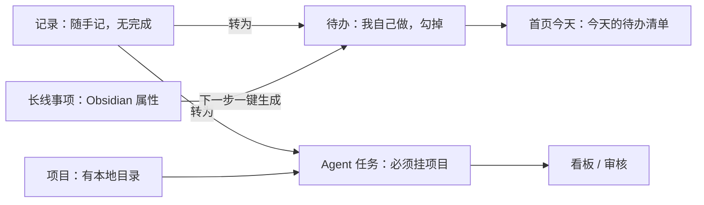

# 第三阶段升级计划：待办与 Agent 任务拆分 + 首页排版

> 状态：已与用户讨论确认，按阶段实施。起因：首页「今天」卡片显示 AI 理由而非用户描述、首页一屏被挤压、「收件箱」含义不清、派给 Agent 的入口难找。讨论后重新划分了记录、待办、Agent 任务、项目、长线事项的边界。

## 1. 已确认的边界

- **记录**：随手丢进来的想法、资料、状态，没有「完成」。可以转成待办、Agent 任务或 Obsidian 笔记。
- **待办**：新增对象 `todo`，自己做、做完勾掉，只需标题。
- **今天**：只放待办。直接勾进来，不需要确认计划；没做完的第二天自动留在「今天」，标「昨天未完成」。AI 建议只是可选按钮，给出「建议先做」提示，不替换卡片内容。卡片显示标题和备注（最多两行）。
- **Agent 任务**：沿用 `task`，只给 Agent 用，必须选有本地目录的项目和执行通道。
- **项目**：有本地目录的代码仓库。
- **长线事项**：内容以 Obsidian 笔记属性为准。「下一步」可一键生成待办；勾掉后不改 Obsidian，只在首页提示「下一步已完成，填新的下一步」。
- **数据安全**：开发与验证不写入真实数据库和 Obsidian，只用 `/tmp` 副本；不重启用户正在使用的客户端。

## 2. 阶段

### 阶段 1：首页排版

- 近期状态移到问候语旁，显示为标签（如「秋招ing · 至 10月6日」），点击后在弹窗里编辑。
- 右列：长线事项 + 底部紧凑栏（AI 日报最新一篇、「本周想起 N 条点子」）；左列：今天、上次工作。
- 窗口高度不足 800px 时问候语缩成一行；面板保留最低高度，放不下时整页滚动。
- 验证：1440×900、1280×720、1024×650 三种窗口截图。

### 阶段 2：待办模型，「今天」改成勾选清单

- `todo` 字段：`title`、`note`、`planned_date`（空为待办池）、`done_at`、`project_id`、`home_item_note`、`home_next_snapshot`、`record_id`、`archived_at`。
- 操作：`create_todo`、`update_todo`、`toggle_todo`、`plan_todo`、`archive_todo`；事件 `TodoCreated`、`TodoCompleted`、`TodoReopened`、`TodoPlanned`。
- 「今天」：未完成且 `planned_date` 不晚于今天的待办，加上今天勾掉的；早于今天的标「昨天未完成」或「N 天前」。
- 停用 `confirm_plan`、`revise_plan`、`add_to_today`，旧 `daily_plan` 数据保留不删。
- `generate_brief` 只对待办给出至多 3 条「建议先做」，取消早上自动生成。
- 日报与「上次工作」读取待办的完成事件；记录可「转为待办」或「转为 Agent 任务」。
- 一次性迁移：执行前自动备份；`executor_type == 'self'` 且没有运行记录的任务转为待办，记 `TaskMigratedToTodo` 事件；可重复执行。
- 新增「待办」页：待办池、今天、已完成。

### 阶段 3：Agent 任务独立，入口前置

- `create_task` / `update_task` 必须有带有效本地目录的项目和执行通道。
- 表单只有标题、要求与完成标准、项目、执行通道；按钮「创建」「创建并派出」。
- 导航名「Agent 任务」；看板列：待派出、运行中、待审核、已完成、失败或取消；去掉「收件箱」。
- 项目详情加「派个 Agent 任务」入口；首页待审核、失败提醒保持不变。

### 阶段 4：长线事项的下一步生成待办

- 「下一步」旁的「→ 今天做」生成待办并加入今天，记录 `home_item_note` 和 `home_next_snapshot`。
- 已勾掉的待办快照等于当前 `home_next` 时提示「下一步已完成，填新的下一步」；改了下一步后提示消失。不写 Obsidian。

### 阶段 5：文档与验收

- 更新方向文档（数据归属、每日流程四步、模块边界）与 README。
- 验收记录 `docs/2026-09-29_phase3-verification.md` 及截图；`npm run check`；重建桌面客户端。

## 3. 风险与取舍

- 停用今日计划确认后旧 `daily_plan` 不再显示，数据保留。
- 迁移在用户重启新客户端时对真实数据库执行，执行前自动备份，事先在 `/tmp` 副本上验证。
- 导航多出「待办」一项；「审核」是否并入「Agent 任务」页，用过之后再定。
