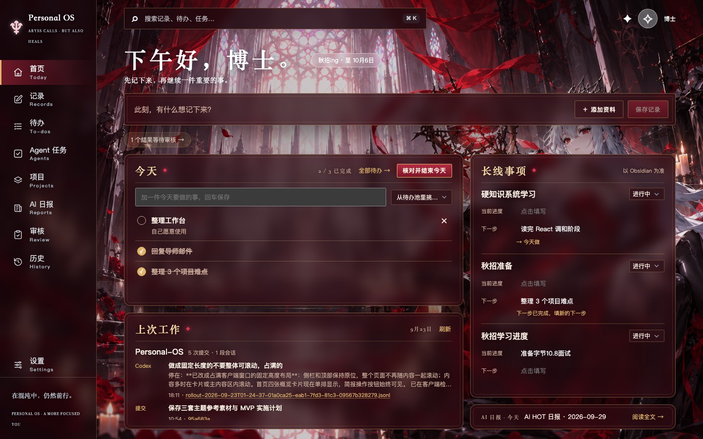
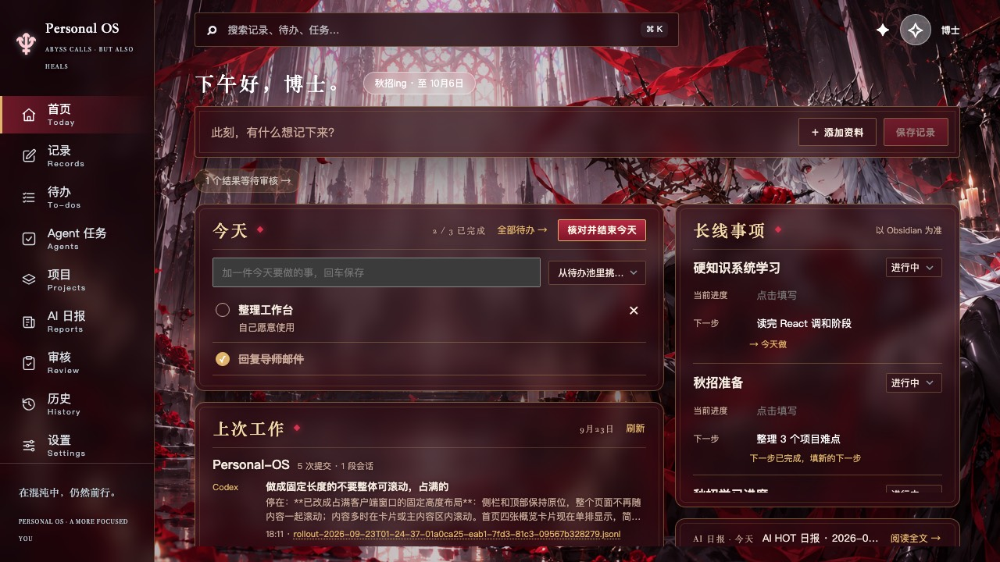
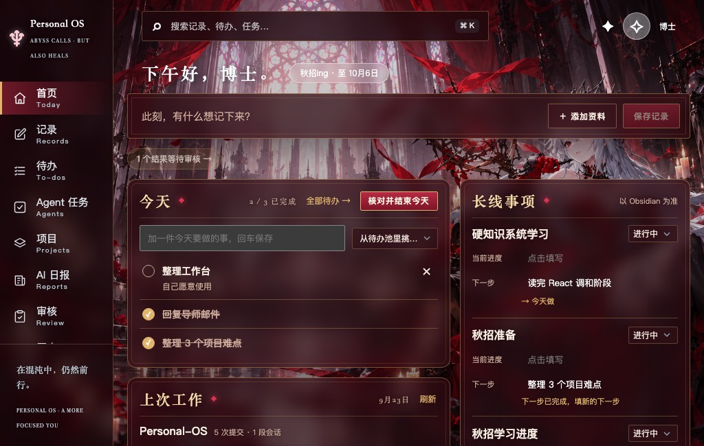
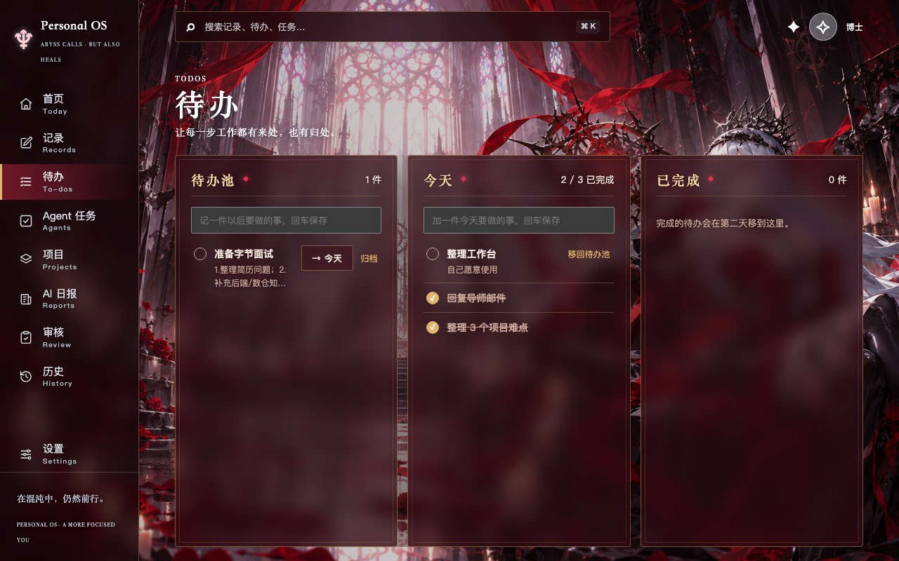
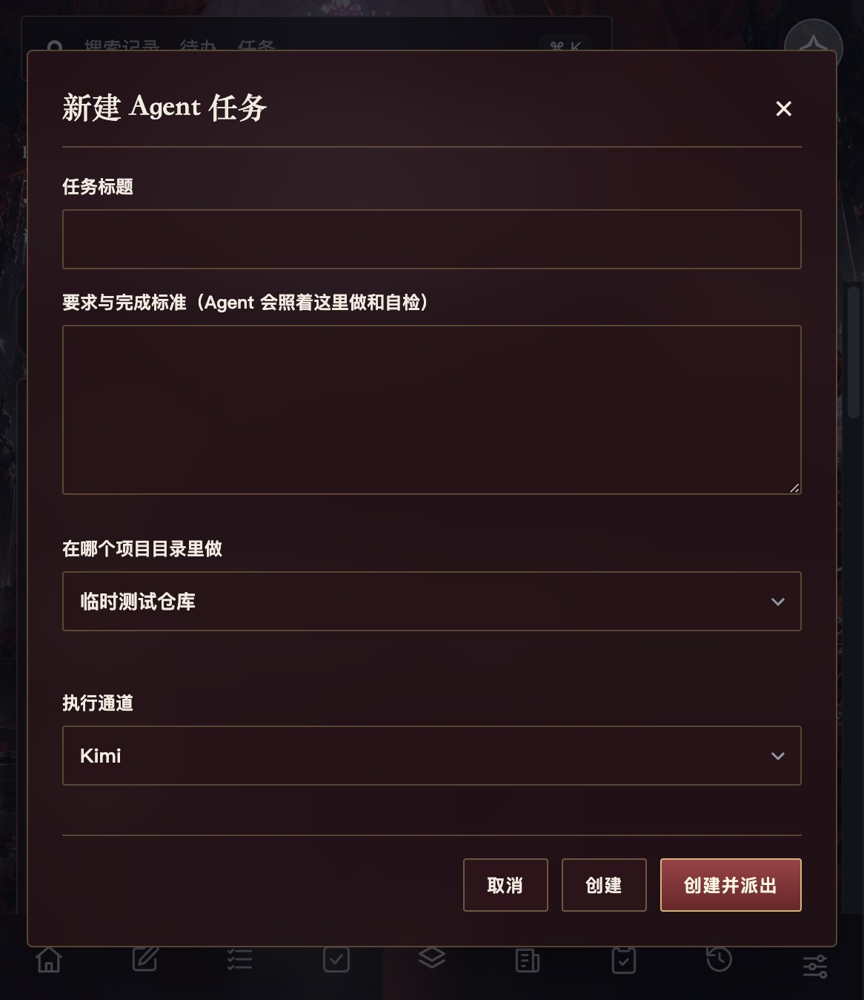
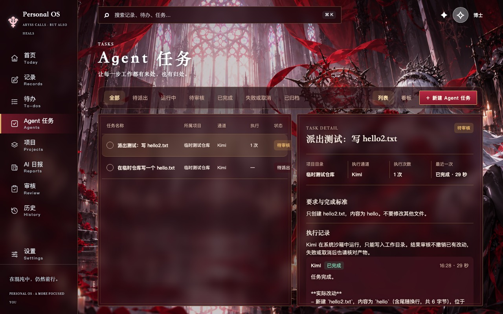
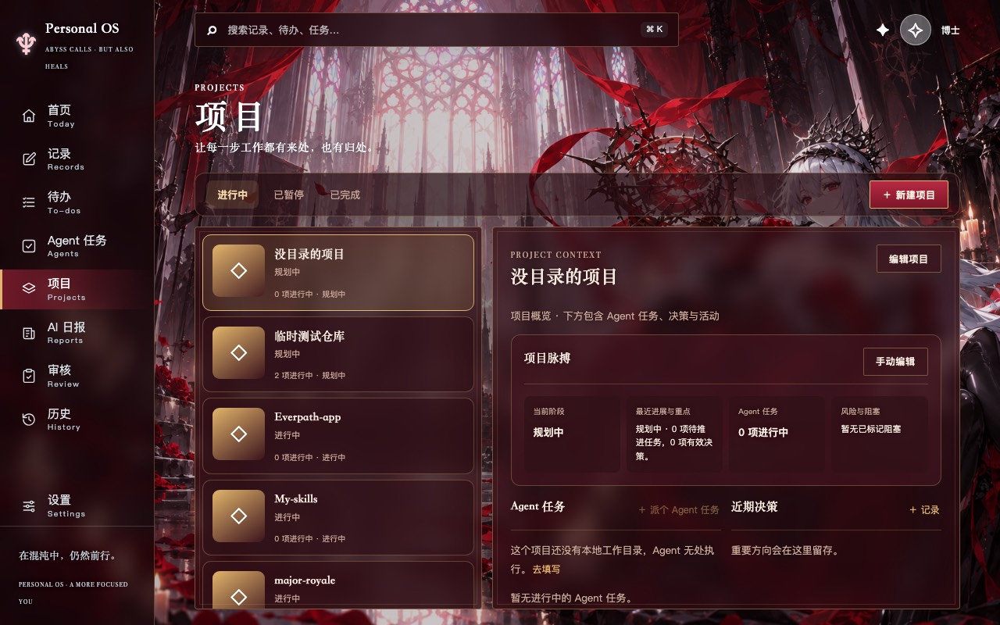

# 第三阶段（待办与 Agent 任务拆分、首页排版）验收记录

范围依据 [第三阶段计划](2026-09-29_phase3-plan.md)。界面走查和迁移核对都使用复制到 `/tmp/pos-p3/` 的数据库和 Obsidian 首页相关笔记副本；唯一一次真实派单只针对 `/tmp/pos-p3/repo` 临时仓库。未写入真实客户端数据库、真实 Obsidian vault 或真实项目，也未重启正在运行的客户端。

## 阶段与提交

| 阶段 | 交付 | 验证 | 提交 |
|---|---|---|---|
| 0 | 第三阶段计划文档 | — | `f6b5893` |
| 1 | 近期状态改为问候语旁的标签（点击弹窗编辑）；右列为长线事项加紧凑栏（AI 日报最新一篇、本周想起的点子）；窗口矮于 800px 时问候语缩成一行，面板保留最低高度后整页滚动 | 1440×900、1280×720、1024×650 截图 | `ec0fbcb` |
| 2 | 新对象「待办」与待办页；首页「今天」改为待办勾选清单并自动顺延；停用今日计划确认；AI 建议改为点击才生成；日报与上次工作读取待办；记录可转待办；旧的「我自己」任务一次性迁移为待办 | `tests/test_todos.py`，真实库 `/tmp` 副本迁移核对，浏览器勾选走查 | `63d37f7` |
| 3 | Agent 任务必须挂有本地目录的项目并选通道；新表单「创建 / 创建并派出」；看板改为待派出、运行中、待审核、已完成、失败或取消；项目页「派个 Agent 任务」；情报「交给 Agent 深入研究」改走同一表单 | 新增创建约束测试，原有派单测试迁移；真实 Kimi 派单一次 | `c4f0023` |
| 4 | 长线事项「下一步」旁的「→ 今天做」；勾掉后提示「下一步已完成，填新的下一步」，不写 Obsidian | `tests/test_obsidian_home.py` 新用例，浏览器走查 | `dd6f83e` |
| 5 | 本记录、方向文档第 3、4 节与模块边界、README；重建客户端 | `npm run check`，`codesign --verify` | 本次提交 |

## 检查结果

- `npm run check`：前端构建通过；前端测试 15 项通过；Python 测试 139 项通过。
- `./scripts/build-macos-app.sh` 重建 `build/Personal OS.app`，`codesign --verify --deep --strict` 通过；包内 `server/` 与 `dist/` 与源码一致。

## 迁移核对（真实库的 `/tmp` 副本）

在 `/tmp/pos-p3/db-original.sqlite3`（真实客户端库的副本）上启动新代码：

- 原有两条「我自己」执行、从未派过 Agent 的任务转成待办池里的待办：「准备字节面试」（描述转为备注）、「整理工作台」（备注和所属项目保留）。原任务删除，各记一条 `TaskMigratedToTodo` 事件。
- 转换前自动生成一份备份。再次启动不重复转换、不再备份。
- 派过 Agent 的任务、Agent 任务不受影响（`tests/test_todos.py` 覆盖）。

真实客户端会在你重启到新版本时执行同样的迁移，执行前自动备份。

## 界面走查

### 首页

1440×900：一屏放下四块，问候语旁是近期状态标签。

1280×720：问候语缩成一行，副标题隐藏。「今天」面板内容多于两行时在面板内滚动（截图中第三条已勾掉的待办在面板下方）。

1024×650：面板保留最低高度，整页滚动，不再被压扁。

长线事项：点击「秋招准备」下一步旁的「→ 今天做」后，「整理 3 个项目难点」出现在今天，事项下显示「已在今天的待办 →」；勾掉后显示「下一步已完成，填新的下一步」。之后核对 `/tmp` vault 副本中的笔记，`home_next` 仍是原值，应用没有写入。

### 待办页

待办池、今天、已完成三栏。「准备字节面试」是迁移来的待办，备注最多显示两行。

### Agent 任务

新建表单只有标题、要求与完成标准、项目、执行通道。项目下拉只列出有本地目录的项目，通道默认选第一个本机可用的。

- 「创建」：任务进入「待派出」，没有启动执行。
- 「创建并派出」：在 `/tmp/pos-p3/repo` 用 Kimi 真实派出一个「只创建 hello2.txt」的任务，约 29 秒后结束，任务进入「待审核」，仓库中只多了 `hello2.txt`。
- 看板五列：待派出、运行中、待审核、已完成、失败或取消。

没有本地目录的项目：「派个 Agent 任务」不可用，并提示去填写目录。

## 已知限制与待你确认

- 重启客户端后才会切到新版本并执行迁移。迁移前的备份可在「设置 → 数据备份与恢复」中选择。注意恢复后会再次自动转换，因为新版本启动和恢复时都会检查旧任务。
- 1280×720 下「今天」只露出两条，其余在面板内滚动。如果你平时窗口就这么大、待办又多，可以再讨论是否让「上次工作」默认收起。
- 「审核」仍是独立导航页，是否并入「Agent 任务」页留到用过之后再定（导航现为 9 项）。
- 旧的今日计划数据留在库里，不再显示。
- 情报页的「交给 Agent 深入研究」现在要先选有目录的项目；情报页当前已从导航收起，未单独截图。
