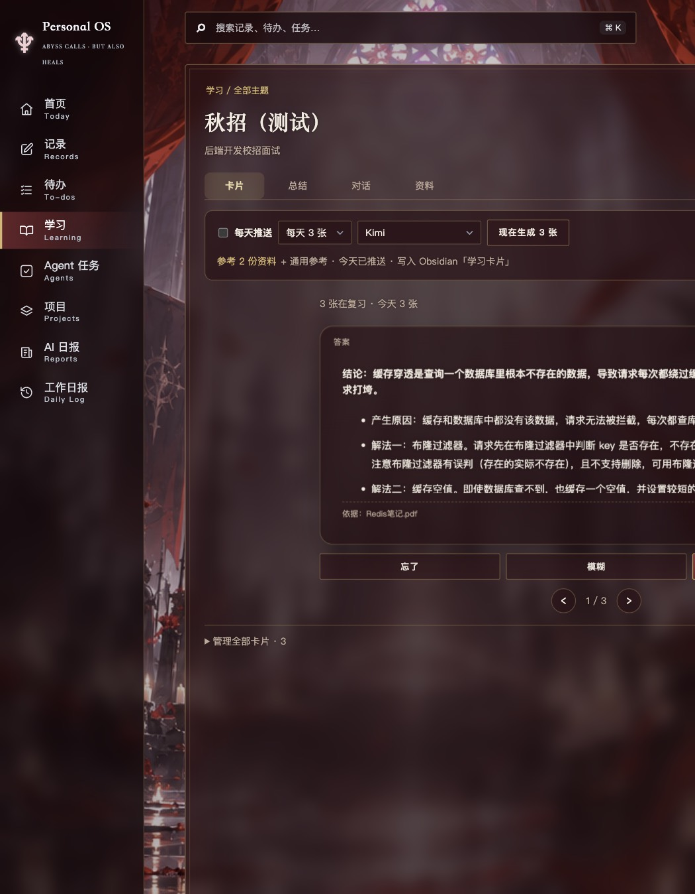
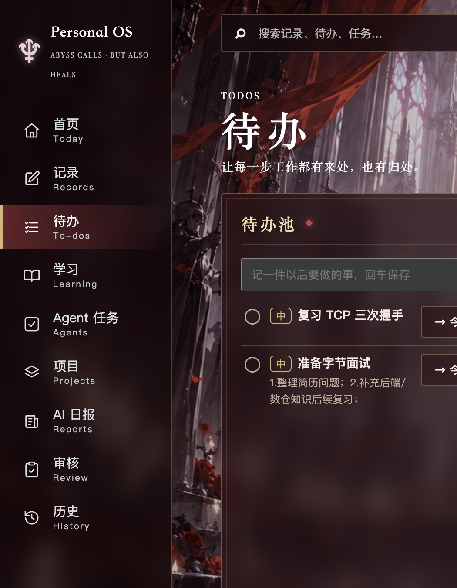
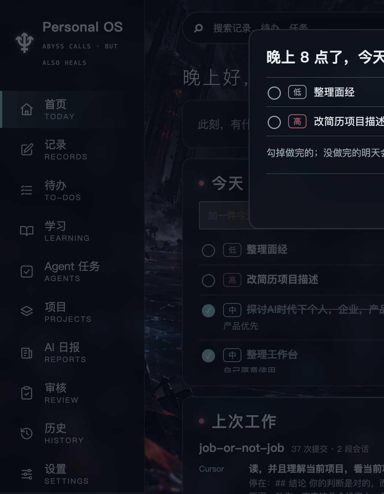
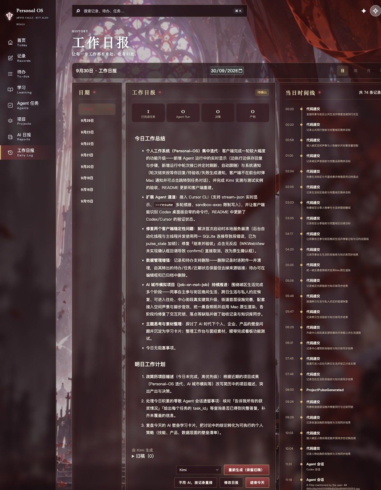

# 卡片参考资料、待办排序提醒与工作日报验收记录

范围依据 [卡片参考资料、待办排序提醒与工作日报计划](2026-09-30_cards-todos-report-plan.md)。浏览器走查用 `/tmp/pos-cards-ui/` 的数据库副本（关闭自动任务，Obsidian vault 指向该目录下的 `vault/`）。未写入真实客户端数据库或真实 Obsidian vault。参考资料用的是临时编写的测试简历和 Redis 讲义，没有用真实简历。

## 阶段与提交

| 阶段 | 交付 | 验证 | 提交 |
|---|---|---|---|
| 0 | 计划文档 | — | `c714d79` |
| 1 | 修复一次点击出现六张卡片：同一主题同时只允许一次生成；手动生成成功也算当天已推送 | `tests/test_cards.py`（并发与失败后仍可推送） | `ce6cb71` |
| 2 | 主题资料页上传 md / txt / pdf，逐份开关「用于卡片」；学习页「通用参考」；生成时区分背景资料与知识资料，记录依据，资料外内容标「资料外补充：」 | `tests/test_cards.py`（资料、排除、通用参考、依据） | `d2a586d` |
| 3 | 主题卡片页一次一张、翻面、左右切换，到期卡片翻面后评分；完整列表收进「管理全部卡片」；首页今日学习同样式 | `tests/frontend/cards.test.js`；浏览器走查 | `25f6983` |
| 4 | 待办低 / 中 / 高优先级（彩色标签，点一下切换）；拖动排序（待办池、今天、首页今天，可跨栏）；每晚 8 点提醒今天未完成的待办 | `tests/test_todos.py`、`tests/frontend/todos.test.js`；浏览器走查 | `77a3c5e` |
| 5 | 审核移出侧栏（页面保留，任务页有待确认知识写入时提示）；「历史」改为「工作日报」，可选通道生成「今日工作总结」和「明日工作计划」 | `tests/test_daily_report.py`；浏览器走查 | `8246443` |
| 6 | 本记录、README；重建客户端 | `npm run check`，`codesign --verify` | 本次提交 |

## 检查结果

- `npm run check`：前端构建通过；前端测试 25 项通过；Python 测试 172 项通过。
- `./scripts/build-macos-app.sh` 重建 `build/Personal OS.app`，`codesign --verify --deep --strict` 通过。

## 浏览器走查（`/tmp/pos-cards-ui/`）

### 卡片参考资料

1. 新建主题「秋招（测试）」，在「资料」页用「上传文件」一次选中 `简历-测试.md` 和 `Redis笔记.pdf`：两份都关联到主题，PDF 显示「已提取 1/1 页文字」，两份的「用于卡片」默认勾选。
2. 学习页「通用参考」填入「卡片正面不超过 40 字；背面先给结论，再分点说理由。」，提示「通用参考已保存」。
3. 卡片页显示「参考 2 份资料 + 通用参考」。用 Kimi「现在生成 3 张」，29 秒后提示「Kimi 生成了 3 张卡片，参考了 2 份资料」，只生成 3 张：
   - 题目按简历选：简历写了「分布式锁（SET NX PX + Lua 释放）」，就出了「为什么释放锁要用 Lua 脚本」，答案结尾联系简历里的秒杀项目；
   - 答案以讲义为准：TTL 随机值「0~300 秒」、Lua「先 GET 比较再 DEL」与讲义一致；
   - 依据分别为「Redis笔记.pdf、简历-测试.md」「Redis笔记.pdf」；讲义之外的内容单独一段「资料外补充：」；
   - 正面都不超过 40 字，背面先写结论再分点，符合通用参考。
4. 卡片页一次只显示一张，点击翻面看答案和依据，翻面后可评分，底部「‹ 1 / 3 ›」切换。

### 待办

1. 每条待办前有优先级标签，点击在中 → 高 → 低之间切换；标签和标题在同一行。
2. 拖动（用页面脚本派发与浏览器相同的 dragstart / dragover / drop 事件；自动化工具不支持拖动整行）：
   - 把待办池的「改简历项目描述」拖到今天「准备字节面试」上方：悬停时显示插入线，放下后进入今天并排在最前；
   - 在今天里把「整理面经」拖到最上面；
   - 把「准备字节面试」拖回待办池、排在「复习 TCP 三次握手」下方。
   三次结果都与服务端顺序一致。有排序之前创建的待办排在前面，新建的按拖动顺序排在后面。
3. 8 点提醒（把页面时钟改为 21 点模拟）：弹出「晚上 8 点了，今天还有 2 件没完成」，列出今天没完成的两件，顺序与拖动结果一致。在弹框里勾掉一件后变为「还有 1 件」。点「知道了，今晚不再提醒」后提示「今晚不再提醒」，`settings.todo_reminder_date` 记为当天；刷新页面并等待 30 秒，不再弹出。

### 工作日报与审核

1. 侧栏为：首页、记录、待办、学习、Agent 任务、项目、AI 日报、工作日报、设置。`#review` 仍能打开审核页。
2. 工作日报页当天没有日报时，显示通道选择（默认第一个可用的 Kimi）、「生成日报」和「不用 AI，按记录生成草稿」。点「生成日报」：按钮变为「生成中…」，18 秒后提示「Kimi 已生成工作日报」。
   - 「今日工作总结」按项目归纳（Personal-OS 迭代、Agent 通道、两个稳定性修复、删除功能、job-or-not-job 城区推进、主题思考），74 条时间线没有被逐条抄进来；
   - 「明日工作计划」第一条是今天没完成的高优先级待办「改简历项目描述」；
   - 正文按 Markdown 显示，下方注明「由 Kimi 生成」；右侧时间线保留作为依据；已有日报时按钮为「重新生成（保留旧稿）」，另有「不用 AI，按记录重排」、修改日报、结束今天。
3. 首页「核对并结束今天」跳到工作日报页。
4. 在数据库副本里临时加一条待确认的知识写入：Agent 任务页顶部显示「有 1 条知识写入等你确认。去确认 →」，点击进入审核页；验证后已删除这条数据。

## 未验证与已知限制

- 8 点提醒是改页面时钟模拟的，没有等到真实 20:00；客户端不在前台时的 Mac 通知走已有的通知通道，本次没有在客户端里单独触发。
- 拖动用脚本事件验证，没有用真实鼠标；排序逻辑由单元测试覆盖。
- 工作日报和卡片都只用 Kimi 真实调用了一次；Codex / Claude Code / Cursor 走同一段代码，未分别调用，以节省额度。WorkBuddy 仍未登录，待登录后验证。
- 真实数据库里之前重复生成的 3 张卡片需要你在「管理全部卡片」里手动删除。
