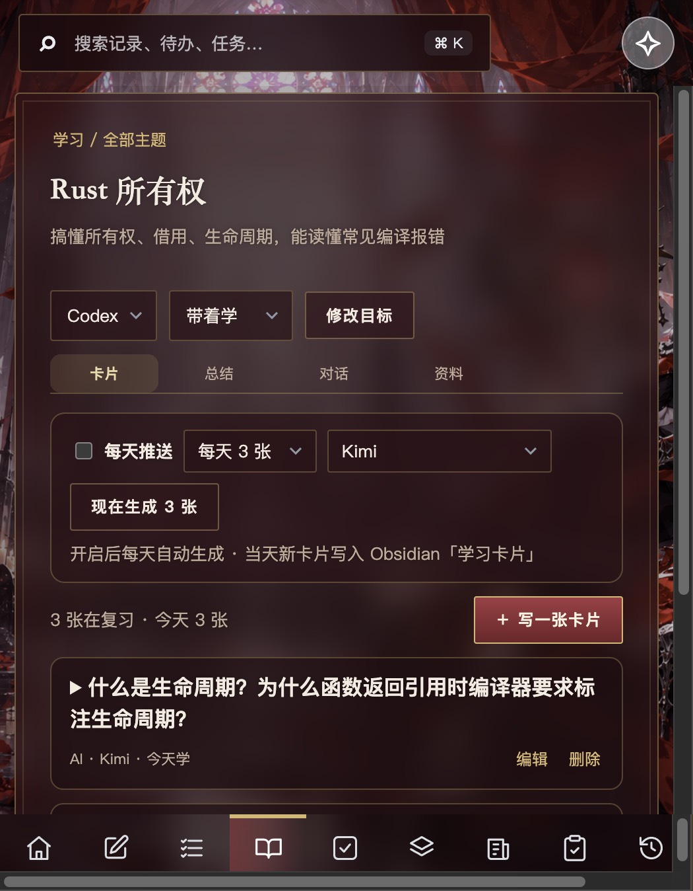
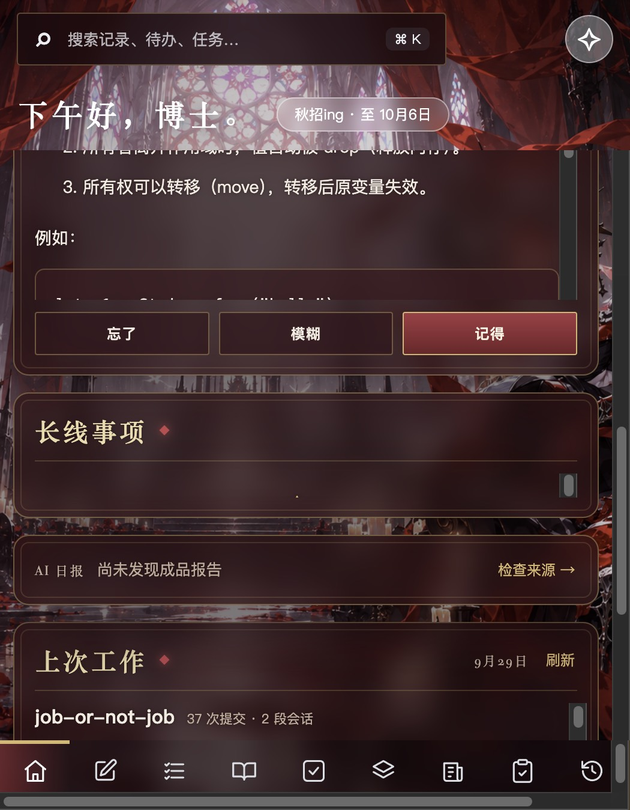
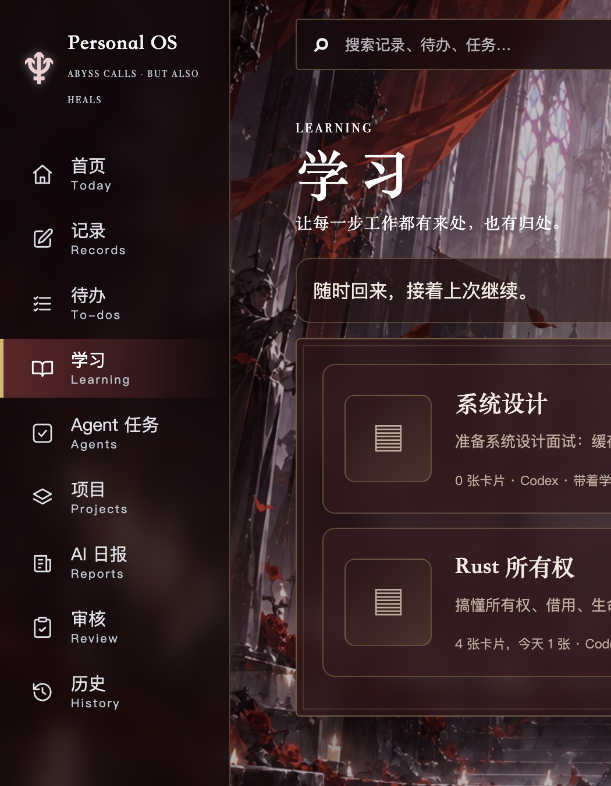

# 学习卡片与 WorkBuddy 通道验收记录

范围依据 [学习卡片与 WorkBuddy 通道计划](2026-09-30_learning-cards-plan.md)。浏览器走查用 `/tmp/pos-cards-ui/` 的数据库副本，客户端实测用 `/tmp/pos-cards-app/` 数据目录另开的测试实例（关闭自动任务）；两处 Obsidian vault 都指向各自目录下的 `vault/`。未写入真实客户端数据库或真实 Obsidian vault。

## 阶段与提交

| 阶段 | 交付 | 验证 | 提交 |
|---|---|---|---|
| 1 | 计划文档 | — | `ffb73c7` |
| 2 | 卡片增删改、忘了/模糊/记得排期与已掌握、主题推送设置、按所选通道在临时目录生成、每日推送、当天卡片写入 Obsidian | `tests/test_cards.py`（8 项，假运行时） | `c4d7e39` |
| 3 | WorkBuddy 通道（自带的 CodeBuddy CLI），Agent 任务与卡片生成共用 | `tests/test_runtime.py`（未登录时的真实输出样本、命令路径） | `f43834d` |
| 4 | 侧栏恢复「学习」；主题「卡片」页（推送设置、现在生成、写/改/删、已掌握与恢复、失败原因）；首页「今日学习」翻卡复习；删除操作提示「已删除」 | `tests/frontend/cards.test.js`；浏览器走查 | `22d18b9` |
| 5 | 本记录、README；重建客户端 | `npm run check`，`codesign --verify` | 本次提交 |

## 检查结果

- `npm run check`：前端构建通过；前端测试 21 项通过；Python 测试 159 项通过。
- `./scripts/build-macos-app.sh` 重建 `build/Personal OS.app`，`codesign --verify --deep --strict` 通过。

## 浏览器走查（`/tmp/pos-cards-ui/`）

1. 新建主题「Rust 所有权」，进入后默认是「卡片」页。生成通道选 Kimi，点「现在生成 3 张」：按钮变为「正在生成…」，约 20 秒后出现 3 张卡片，来源显示「AI · Kimi · 今天学」；`vault/学习卡片/2026-09-30.md` 按主题写入 3 张卡片的问题和解答。
2. 「写一张卡片」写入一张自己的卡片（背面为 Markdown 列表），来源显示「我写的」。
3. 首页右栏顶部「今日学习」显示「还剩 4 张」，从最早的新卡开始；「看答案」后显示 Markdown 背面和忘了 / 模糊 / 记得。依次选记得、忘了、模糊，服务端排期为：记得 → 7 天后（第 1 档）；忘了 → 明天；模糊 → 3 天后。剩下 1 张。
4. 通过接口把「记得」那张再记得 3 次：14 天、30 天，第三次标为已掌握。主题页出现「已掌握 · 1」，点「恢复复习」后回到复习列表；删除一张卡片后提示「卡片已删除」。
5. 生成通道改成本预览服务找不到的 Codex，点「现在生成」：主题里显示「上次生成失败：本机未找到 Codex 命令行」，同时弹出错误提示，已有卡片不受影响。
6. 桌面宽度（1440）下首页右栏：今日学习 192px、长线事项 339px；翻开答案时今日学习变为 340px，长线事项缩到 190px，评分后恢复。答案区最高 220px，超出滚动。
7. 学习列表每个主题显示卡片数、今天到期数和推送设置。

## 客户端实测（`/tmp/pos-cards-app/`）

重建后的客户端能找到 Codex（桌面版自带的 codex-cli）、Kimi、Claude Code、Cursor、WorkBuddy。新建主题「HTTP 缓存」，每天 1 张，用默认的 Codex 生成：约 26 秒生成 1 张（「为什么 `Cache-Control: no-cache` 不表示“禁止缓存”？」），并写入测试 vault。

## 未验证与已知限制

- **WorkBuddy 未登录**：本机 CodeBuddy CLI 仍提示「Authentication required」。未登录时的失败显示已按真实输出验证；登录后的真实派单、多轮续接、沙箱是否还需要放行 `~/.codebuddy` 以外的目录、以及卡片生成，都待登录后验证。登录方法：终端运行 `"/Applications/WorkBuddy.app/Contents/Resources/app.asar.unpacked/cli/bin/codebuddy"`，输入 `/login`。
- 每日自动推送只由单元测试覆盖（测试实例关闭了自动任务，没有等到真实的 8 点触发）。
- Claude Code、Cursor 生成卡片走同一段代码，未分别真实调用，以节省额度。
