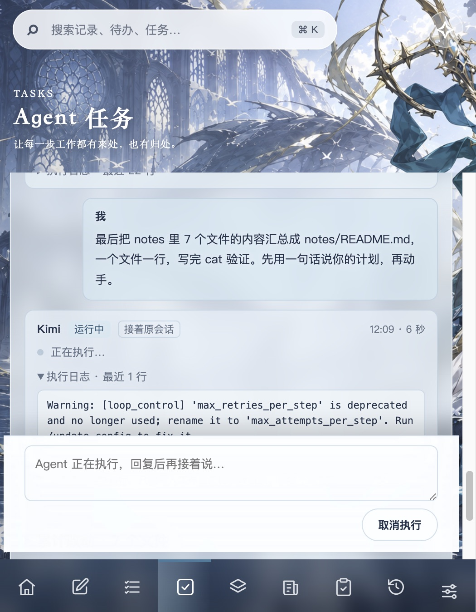

# Agent 运行中实时显示与系统通知验收记录

范围依据 [实时显示与系统通知计划](2026-09-30_live-progress-notify-plan.md)。浏览器走查用 `/tmp/pos-p3/` 的数据库副本；通知验证用 `/tmp/pos-notify/` 数据目录另开的客户端测试实例（关闭自动任务，Obsidian vault 指向 `/tmp` 副本）。真实 Kimi 派单只针对 `/tmp/pos-p3/repo`。未写入真实客户端数据库、真实 Obsidian vault 或真实项目。

## 阶段与提交

| 阶段 | 交付 | 验证 | 提交 |
|---|---|---|---|
| 1 | 计划文档 | — | `20a1ae7` |
| 2 | 运行时在出现新回复或步骤时回调，存储层每秒最多保存一次并补一次尾部保存；新接口 `GET /api/agent_runs/running`；前端有运行中的轮次时每 1.5 秒刷新，运行中显示已有回复和「正在执行 · 最近一步」，停在底部时自动跟随；全量刷新改为 30 秒 | `tests/test_runtime.py`（运行中已保存回复与步骤）、`tests/frontend/live-runs.test.js`（合并、写入时丢弃轻量读取）；Kimi 真实三轮 | `f87bf16` |
| 3 | 一轮结束时生成通知（等你回复、待验收、失败）；客户端不在前台时发 Mac 通知，点击跳到任务对话；`PERSONAL_OS_DATA_DIR` 测试数据目录 | `tests/frontend/live-runs.test.js`（通知判断）；Swift 编译、签名校验 | `bc6d96c` |
| 3 补 | 没有运行中的轮次时每 5 秒轻量检查一次，别处启动的执行也能及时显示和通知 | 通知实测 | `c510632` |
| 4 | 本记录、README；重建客户端 | `npm run check`，`codesign --verify` | 本次提交 |

## 检查结果

- `npm run check`：前端构建通过；前端测试 19 项通过；Python 测试 144 项通过。
- `./scripts/build-macos-app.sh` 重建 `build/Personal OS.app`，`codesign --verify --deep --strict` 通过。

## 实时显示（Kimi 2.1.1，`/tmp/pos-p3/repo`）

任务「实时显示测试：写三个说明文件」。

1. 第一轮：每 3 秒查询一次新接口，步骤依次出现：`Write notes/a.md` → `Bash cat notes/a.md` → `Write notes/b.md` → … → `Bash cat notes/c.md`，共约 23 秒。
2. 第二轮（要求每写完一个文件用一句话报进度）：每 2 秒读取一次页面，「正在执行 · 最近一步」依次显示 `Bash cat notes/d.md`、`Write notes/e.md`、`Bash cat notes/e.md`、`Write notes/f.md` …，Kimi 的进度文字随之增加到 3 段。这一轮是用 `curl` 发出的，页面在约 8 秒后才发现；补上 5 秒的轻量检查后，这类情况最多延迟 5 秒。
3. 第三轮从页面输入框发出：发送后立即出现「运行中 · 接着原会话」和「正在执行…」。停在对话底部时，回复完成后页面自动跟到末尾。

Kimi 的 stream-json 按整条消息输出，不是逐字输出，所以文字是一段一段出现的。

## 系统通知（客户端测试实例）

`open -n --env PERSONAL_OS_DATA_DIR=/tmp/pos-notify --env PERSONAL_OS_DISABLE_AUTOMATION=1 'build/Personal OS.app'` 启动测试实例，确认其后台服务的环境变量和数据库路径都指向 `/tmp/pos-notify`。测试实例放在后台，用它的接口派出「通知测试：写个小工具」（要求里不说语言）。

1. 第一轮 Kimi 提问并标记，结束时触发第一次通知，系统弹出授权请求，用户点「允许」。
2. 回复「用 Bash」后第二轮接着原会话完成，用户收到「通知测试：写个小工具 · Kimi 这一轮做完了，待验收」通知；点击后测试实例来到前台并打开这个任务的对话。

失败通知和「取消不通知」由前端测试覆盖，未在客户端里实测。

## 已知限制

- 通知由客户端页面判断：客户端没开时不会有通知（客户端退出时直连通道也会中断）。后台时系统可能降低页面定时器频率，通知可能晚几秒。
- 测试实例与正式客户端包标识相同，通知授权共用；两个窗口外观一样，关掉最后一个窗口会退出对应的那个实例。
- Kimi 本机配置里的 `max_retries_per_step` 已弃用，每轮日志开头都有一行警告；改 Kimi 配置即可消除，应用未过滤。
